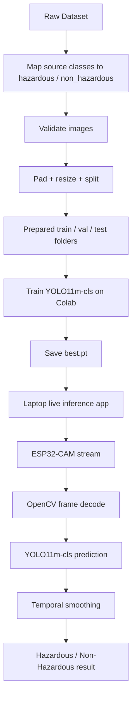

# GC-Car Project Master Guide
## Gesture-Controlled Hazardous Waste Rover

This guide is the report-style summary for the full project: hardware control, camera streaming, AI training, and live classification.

---

## 1. Project Understanding

Your system has two main blocks:

- Hardware control:
  a gesture transmitter sends rover motion commands.
- AI vision:
  an ESP32-CAM streams video and a laptop classifies the waste in view.

Working sequence:

1. The user tilts the transmitter.
2. MPU6050 senses tilt.
3. nRF24L01+ sends the command wirelessly.
4. Receiver Nano drives the motors through L298N.
5. ESP32-CAM streams live video over Wi-Fi.
6. The laptop runs the trained YOLO11 classifier.
7. The system outputs `hazardous` or `non_hazardous`.

Important clarification:

- `hazardous / non_hazardous` and `dry / wet` are different taxonomies.
- For this rover, the stronger first model is `hazardous / non_hazardous`.
- If you must also demonstrate `dry / wet`, do it as a second-stage model after the hazard decision.

---

## 2. Dataset Reality Check

As checked in this workspace on `April 21, 2026`, the local dataset copy contains `10` source folders and `12,259` images:

| Class | Images | Project label |
|---|---:|---|
| battery | 756 | hazardous |
| biological | 699 | hazardous |
| cardboard | 1411 | non_hazardous |
| clothes | 1892 | non_hazardous |
| glass | 1736 | hazardous |
| metal | 930 | hazardous |
| paper | 1336 | non_hazardous |
| plastic | 1597 | non_hazardous |
| shoes | 1449 | non_hazardous |
| trash | 453 | hazardous |

Mapped totals from the local copy:

- `hazardous`: `4574`
- `non_hazardous`: `7685`

So the current local dataset is not already a hazardous-waste dataset. It must be remapped into project-specific safety labels.

---

## 3. Project Hazard Label Logic

For this rover, `hazardous` means waste that can:

- injure workers
- puncture tyres
- spread infection
- leak toxins
- start a fire
- explode
- require special handling

Project mapping:

| Source class | Label | Reason |
|---|---|---|
| battery | hazardous | fire, explosion, toxic leakage |
| biological | hazardous | infection / contamination |
| glass | hazardous | cuts and punctures |
| metal | hazardous | sharp edges and punctures |
| trash | hazardous | mixed unknown content |
| cardboard | non_hazardous | low acute danger |
| paper | non_hazardous | low acute danger |
| plastic | non_hazardous | lower immediate road hazard |
| clothes | non_hazardous | lower immediate road hazard |
| shoes | non_hazardous | lower immediate road hazard |

This is a project-safety labeling policy, not a legal hazardous-waste decision.

---

## 4. Dump-Yard Waste Types That Are Dangerous

For the report, the main hazardous groups are:

### Physical injury hazards
- broken glass
- sharp metal
- nails, blades, wires
- needles and other sharps

### Fire / explosion hazards
- lithium batteries
- damaged battery packs
- aerosol cans
- compressed-gas cylinders
- fireworks, propellants, airbag inflators

### Toxic / corrosive / reactive hazards
- paints, thinners, solvents
- acids and strong cleaners
- pesticides
- oil and chemical residues

### Infectious / biomedical hazards
- syringes
- blood-contaminated bandages
- laboratory waste
- pathological waste

### Radioactive / mixed hazards
- radioactive medical waste
- waste contaminated by radiological material
- mixed hazardous + radioactive waste

### Mercury / universal waste
- fluorescent lamps
- mercury thermometers
- mercury switches
- some batteries

---

## 5. Best YOLO Model for Your Laptop

Laptop:

- Intel Core i5-13420H
- `16 GB RAM`
- `RTX 4050 Laptop GPU (6 GB VRAM)`

Recommended model:

**`YOLO11m-cls`**

Why:

- better accuracy reserve than `n` and `s`
- still easy to run live on RTX 4050
- better balance of accuracy and latency than `l` or `x`
- appropriate for a 2-class field demo

Use case assumption:

- one waste item should dominate the frame.
- if you later want full cluttered-road recognition, move to YOLO detection with bounding-box labels.

---

## 6. Hardware Methodology

### Step 1. Assemble transmitter
1. Wire Nano, MPU6050 and nRF24L01+ adapter.
2. Upload the transmitter sketch.
3. Keep the transmitter flat during startup calibration.
4. Check Serial Monitor for angle values and successful radio writes.

### Step 2. Assemble receiver
1. Wire Nano, nRF24L01+ adapter, L298N and motors.
2. Upload the receiver sketch.
3. Confirm failsafe stop works when no packet is received.
4. Verify forward, backward, left and right gestures.

### Step 3. Make power stable
1. Use the rover battery for the motors.
2. Use a separate `5V` buck converter for Nano, nRF and ESP32-CAM.
3. Join all grounds together.

### Step 4. Mount ESP32-CAM
1. Flash `esp32_stream.ino`.
2. Remove the `GPIO0`-to-`GND` flash jumper after upload.
3. Note the IP address from Serial Monitor.

### Step 5. Validate video
1. Run the OpenCV stream viewer.
2. Check smooth live video.
3. Mount the camera angle so the object can fill most of the frame.

---

## 7. AI Pipeline



---

## 8. AI Methodology

1. Start from the garbage image dataset.
2. Remap each source class into project safety labels.
3. Prepare train / val / test folders.
4. Fine-tune `YOLO11m-cls` using transfer learning.
5. Evaluate with accuracy, confusion matrix, ROC and PR curves.
6. Download `best.pt`.
7. Run live inference on the laptop with the ESP32-CAM stream.

Current limitation:

- this is an image-classification pipeline, so it works best when one object is prominent.
- for many objects in one road scene, a detection dataset is the next upgrade.

---

## 9. Execution Order

### Laptop setup
```powershell
py -3.11 -m venv gc_car_env
gc_car_env\Scripts\activate
pip install -r requirements.txt
pip install torch torchvision --index-url https://download.pytorch.org/whl/cu121
python -c "import torch; print(torch.cuda.is_available(), torch.cuda.get_device_name(0) if torch.cuda.is_available() else 'CPU')"
```

### Dataset preparation
```powershell
python 03_dataset\prepare_dataset.py
```

### ESP32 stream test
```powershell
python 02_esp32_opencv\esp32_stream_viewer.py --ip <ESP32_IP>
```

### Local model validation
```powershell
python 06_inference\validate_model.py
```

### Live classification
```powershell
python 06_inference\esp32_live_inference.py --ip <ESP32_IP>
```

### Google Colab training flow
1. Upload `prepared_dataset` to Google Drive.
2. Open Colab with GPU runtime.
3. Copy or upload `04_training/train_colab.py`.
4. Set `DRIVE_DATASET_PATH`.
5. Run all cells.
6. Download `gc_car_yolo11m_best.pt`.
7. Place it in `05_model/`.

---

## 10. Best Final Demo Workflow

1. Start the rover hardware.
2. Start the ESP32-CAM stream.
3. Run laptop inference.
4. Drive the rover with the gesture transmitter.
5. Present one waste item at a time in the camera view.
6. Show the red/green result live.

If the final evaluation also asks for `dry / wet`, the best workflow is:

1. Model A:
   hazardous vs non_hazardous
2. Model B:
   dry vs wet on a separate relabeled dataset

Do not force one binary model to represent both meanings at once.

---

## 11. Best Suggestions to Improve the Project

- Replace `L298N` with `TB6612FNG` or another modern driver for better efficiency.
- Use a dedicated `5V` buck converter for logic and camera power.
- Add large decoupling near each nRF module.
- Add an emergency stop button.
- Add LED fill light for low-light dump-yard scenes.
- Collect your own ESP32-CAM viewpoint images for fine-tuning.
- Move from classification to detection for real dump-yard scenes.
- Save snapshots whenever hazardous waste is detected.
- Add battery-voltage monitoring on the rover.
