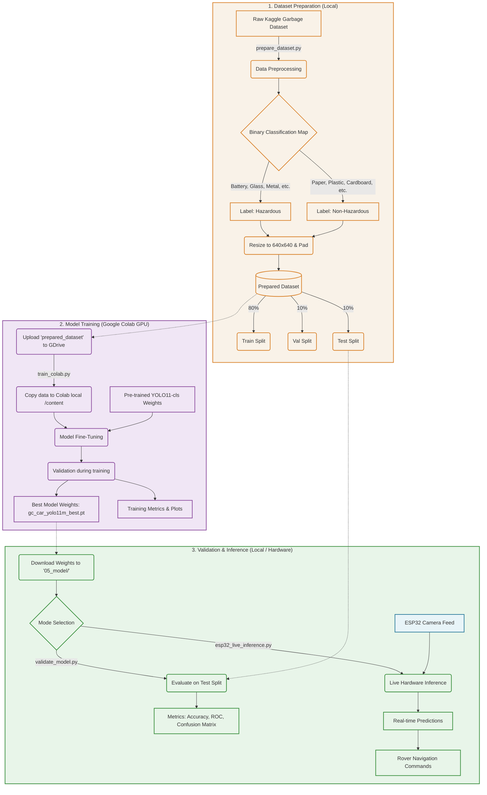

# GC-Car: Gesture Controlled Garbage Classifier Car

GC-Car is a prototype rover that combines gesture-based wireless driving with live garbage classification. The car is driven with a hand-held Arduino Nano transmitter, receives movement commands through nRF24L01+ radio modules, streams camera video from an ESP32-CAM, and runs a trained YOLO classification model on a laptop to label the visible waste as `hazardous` or `non_hazardous`.

## Project Workflow Architecture

## Current Workspace Snapshot

The project folder contains the original hardware sketches, Python utilities, prepared dataset, trained model artifacts, documentation, an empty capture folder, and a checked-in Python virtual environment.

| Area | Purpose | Notes |
|---|---|---|
| `01_hardware/` | Arduino Nano and ESP32-CAM firmware plus hardware reference docs | Project-owned source and hardware documentation |
| `02_esp32_opencv/` | ESP32-CAM stream test utility | Tests MJPEG video before AI inference |
| `03_dataset/` | Raw dataset, prepared dataset, and preparation script | Contains 24,518 image files plus the preparation script |
| `04_training/` | Google Colab training script | Trains YOLO classification models |
| `05_model/` | Trained weights and result images | Contains best/last model checkpoints and plots |
| `06_inference/` | Laptop-side validation and live inference scripts | Runs local validation and real-time classification |
| `07_docs/` | Main README and master guide | Documentation for project execution and report writing |
| `captures/` | Runtime screenshot output location | Currently empty |
| `gc_car_env/` | Local Python virtual environment | Generated dependency folder, about 5 GB, Python 3.11.9 |
| `requirements.txt` | Python dependency list | PyTorch is intentionally installed separately |
| `run_model.bat` | Windows launcher for live inference | Activates `gc_car_env` and starts ESP32 or webcam inference |

Generated folders such as `gc_car_env/` and `__pycache__/` are not project source files. They are documented here because they exist in the workspace, but they can be recreated from the dependency instructions.

## What The Project Does

The system has two connected subsystems.

| Subsystem | What happens |
|---|---|
| Gesture driving | The transmitter Nano reads MPU6050 tilt values, converts the dominant tilt direction into movement commands, and sends packets over nRF24L01+. The receiver Nano reads those packets and drives the L298N motor driver. |
| AI vision | The ESP32-CAM hosts an MJPEG stream at `http://<ESP32_IP>/stream`. A laptop Python script reads the stream, runs YOLO classification on each frame, smooths recent predictions, and overlays the result on the video. |

The intended final demo flow is:

1. Power the transmitter, receiver rover, and ESP32-CAM.
2. Drive the rover using hand tilt gestures.
3. Place one visible waste item in front of the camera.
4. Run laptop inference against the ESP32-CAM stream.
5. Show a live red/green classification result for `hazardous` or `non_hazardous`.

## Classification Policy

This project uses a project-specific safety policy, not a legal hazardous-waste classification standard.

| Source class | Project label | Reason |
|---|---|---|
| `battery` | `hazardous` | Fire, leakage, toxicity, explosion risk |
| `biological` | `hazardous` | Infection and contamination risk |
| `glass` | `hazardous` | Cuts, punctures, tire damage |
| `metal` | `hazardous` | Sharp edges and puncture risk |
| `trash` | `hazardous` | Mixed unknown content |
| `cardboard` | `non_hazardous` | Lower acute handling risk |
| `clothes` | `non_hazardous` | Lower acute handling risk |
| `paper` | `non_hazardous` | Lower acute handling risk |
| `plastic` | `non_hazardous` | Lower acute handling risk |
| `shoes` | `non_hazardous` | Lower acute handling risk |

The model answers only this two-class safety question. It does not classify dry/wet waste, recyclable/non-recyclable waste, or legally regulated hazardous waste.

## Repository File Guide

| File or folder | What it contains |
|---|---|
| `01_hardware/transmitter/transmitter.ino` | Arduino Nano transmitter sketch. Reads MPU6050 tilt, applies startup calibration, applies a 12 degree dead zone, maps tilt into modes and throttle, and sends radio packets at about 50 Hz. |
| `01_hardware/receiver/receiver.ino` | Arduino Nano receiver sketch. Reads nRF24L01+ control packets, applies a 500 ms failsafe timeout, and controls left/right motor pairs through the L298N. |
| `01_hardware/esp32_cam/esp32_stream.ino` | AI Thinker ESP32-CAM sketch. Connects to Wi-Fi, configures the OV2640 camera, and serves an MJPEG stream on `/stream`. |
| `01_hardware/docs/pin_connections.md` | Detailed wiring reference for transmitter, receiver, L298N, motors, ESP32-CAM flashing, ESP32-CAM power, and shared grounding. |
| `01_hardware/docs/hardware_specifications.md` | Report-ready specifications and practical notes for Arduino Nano, nRF24L01+, adapter boards, MPU6050, L298N, DC gear motors, ESP32-CAM, and power distribution. |
| `02_esp32_opencv/esp32_stream_viewer.py` | OpenCV viewer for testing the ESP32-CAM stream before running the classifier. Shows FPS/frame count and can save frames. |
| `03_dataset/prepare_dataset.py` | Dataset preparation utility. Reads `03_dataset/Dataset/`, remaps the 10 source classes to two project labels, validates images, pads/resizes to 640 x 640, and creates train/val/test folders. |
| `03_dataset/Dataset/` | Raw garbage image dataset arranged by source class folders. |
| `03_dataset/prepared_dataset/` | Prepared YOLO classification dataset arranged as `train`, `val`, and `test`, each containing `hazardous` and `non_hazardous` folders. |
| `04_training/train_colab.py` | Google Colab training workflow. Installs packages, mounts Google Drive, copies the prepared dataset to Colab local storage, trains YOLO classification presets, validates on the test split, and saves weights/plots back to Drive. |
| `05_model/gc_car_trained_model/gc_car_yolo11m_best.pt` | Best trained model checkpoint currently present in the workspace. |
| `05_model/gc_car_trained_model/gc_car_yolo11m_last.pt` | Last training checkpoint currently present in the workspace. |
| `05_model/gc_car_trained_model/results.png` | Training results plot exported from Ultralytics/Colab. |
| `05_model/gc_car_trained_model/confusion_matrix.png` | Confusion matrix artifact from training/validation. |
| `05_model/gc_car_trained_model/confusion_matrix_detailed.png` | Detailed confusion matrix plot generated by the Colab workflow. |
| `06_inference/esp32_live_inference.py` | Main laptop inference app. Reads ESP32 MJPEG or local webcam frames, loads the YOLO model, predicts every frame, smooths labels over a 5-frame window, and draws the live HUD. |
| `06_inference/validate_model.py` | Local model validation utility. Loads the model and prepared split, calculates classification metrics, confusion matrix, ROC/PR curves, and sample predictions. |
| `07_docs/project_master_guide.md` | Longer project explanation and methodology notes for report/demo preparation. |
| `07_docs/README.md` | Legacy documentation placeholder (Content merged into this main README). |
| `requirements.txt` | Python packages for computer vision, data handling, plotting, dataset preparation, model training helpers, and inference. |
| `run_model.bat` | Windows launcher that activates `gc_car_env`, checks for the trained model, asks for ESP32-CAM IP or `local`, and starts live inference. |

## Hardware Overview

### Transmitter

| Part | Role |
|---|---|
| Arduino Nano | Main microcontroller for the hand-held transmitter |
| MPU6050 | Measures tilt for gesture control |
| nRF24L01+ with adapter | Sends control packets to the rover |
| 5V power source | Powers Nano, MPU6050 breakout, and radio adapter |

Important transmitter behavior:

- Keep the transmitter flat during startup because the sketch calibrates the MPU6050 after boot.
- Neutral/flat position sends stop.
- Forward/backward tilt controls direction and throttle.
- Left/right tilt controls pivoting or steering mix.
- The RF pipe address is `GCCAR`, and it must match the receiver.

### Receiver Rover

| Part | Role |
|---|---|
| Arduino Nano | Receives radio packets and controls motors |
| nRF24L01+ with adapter | Receives gesture control packets |
| L298N motor driver | Drives the left and right motor pairs |
| Four DC gear motors | 4WD rover movement |
| 7.4V battery | Motor supply |
| 5V buck converter | Recommended logic/camera supply |

Important receiver behavior:

- The receiver stops all motors when no valid packet is received for 500 ms.
- Left motors are driven as one pair and right motors as one pair.
- Forward and backward modes support differential steering.
- Pivot left/right drives the two motor sides in opposite directions.
- All grounds must be common: receiver Nano, radio adapter, L298N, motor battery negative, buck converter ground, and ESP32-CAM ground.

### ESP32-CAM

| Part | Role |
|---|---|
| AI Thinker ESP32-CAM | Captures and streams video |
| OV2640 camera | Image sensor |
| Wi-Fi network | Carries MJPEG stream to laptop |
| 5V buck converter | Recommended stable power source |

Important ESP32-CAM behavior:

- Edit Wi-Fi credentials in the ESP32 sketch before uploading.
- Use GPIO0 to GND only during flashing.
- After upload, remove GPIO0 from GND and reset the board.
- The stream URL is `http://<ESP32_IP>/stream`.
- With PSRAM, the sketch uses VGA 640 x 480. Without PSRAM, it falls back to QVGA 320 x 240.

Full pin-by-pin wiring is maintained in `01_hardware/docs/pin_connections.md`.

## Dataset Details

The raw local dataset currently contains 12,259 source images across 10 folders.

| Raw folder | Image count | Project label |
|---|---:|---|
| `battery` | 756 | `hazardous` |
| `biological` | 699 | `hazardous` |
| `cardboard` | 1,411 | `non_hazardous` |
| `clothes` | 1,892 | `non_hazardous` |
| `glass` | 1,736 | `hazardous` |
| `metal` | 930 | `hazardous` |
| `paper` | 1,336 | `non_hazardous` |
| `plastic` | 1,597 | `non_hazardous` |
| `shoes` | 1,449 | `non_hazardous` |
| `trash` | 453 | `hazardous` |

Mapped source totals:

| Project label | Image count |
|---|---:|
| `hazardous` | 4,574 |
| `non_hazardous` | 7,685 |
| Total | 12,259 |

The prepared dataset currently mirrors the same 12,259 images after validation, resizing, and splitting.

| Split | `hazardous` | `non_hazardous` | Total |
|---|---:|---:|---:|
| `train` | 3,659 | 6,148 | 9,807 |
| `val` | 457 | 768 | 1,225 |
| `test` | 458 | 769 | 1,227 |
| Total | 4,574 | 7,685 | 12,259 |

Dataset preparation details:

- Source folder: `03_dataset/Dataset/`
- Output folder: `03_dataset/prepared_dataset/`
- Split ratio: 80% train, 10% validation, 10% test
- Output image size: 640 x 640
- Resize method: preserve aspect ratio, pad to a square black canvas, save as JPEG
- Minimum accepted dimension: 32 pixels on each side
- Valid extensions: `.jpg`, `.jpeg`, `.png`, `.bmp`, `.webp`, `.tiff`
- Existing `prepared_dataset/` is removed and recreated when the preparation script runs

## AI Model And Training

This project uses Ultralytics YOLO classification, not object detection. That means the model assigns one label to the whole frame. It works best when one waste item dominates the camera view.

| Item | Current project setting |
|---|---|
| Task type | Image classification |
| Labels | `hazardous`, `non_hazardous` |
| Recommended model for final demo | YOLO11m classification |
| Checked-in model artifact | `05_model/gc_car_trained_model/gc_car_yolo11m_best.pt` |
| Inference image size | 224 |
| Confidence threshold in live app | 0.65 |
| Prediction smoothing | Majority vote over the last 5 predictions |

The training script has three presets:

| Preset | Model | Epoch limit | Image size | Batch | Intended use |
|---|---|---:|---:|---:|---|
| `fast` | `yolo11s-cls.pt` | 35 | 192 | 96 | Quick Colab run |
| `balanced` | `yolo11m-cls.pt` | 50 | 224 | 64 | Better final balance |
| `max_accuracy` | `yolo11m-cls.pt` | 100 | 224 | 64 | Slower accuracy-focused run |

The current script default is `fast`. Change the preset inside `04_training/train_colab.py` before running Colab if you want the `balanced` or `max_accuracy` YOLO11m workflow.

## Software Requirements

### Python

The checked-in virtual environment was created with Python 3.11.9. A clean setup should also use Python 3.11 where possible.

Install the standard dependencies from the project root with `pip install -r requirements.txt`.

Install PyTorch separately so the CUDA wheel matches the laptop/GPU. For an RTX 4050 Windows setup, the documented command is `pip install torch torchvision --index-url https://download.pytorch.org/whl/cu121`.

Main Python packages used:

| Package | Used for |
|---|---|
| `ultralytics` | YOLO model training, validation, and inference |
| `opencv-python` | Camera stream display, image decoding, HUD drawing |
| `requests` | HTTP MJPEG stream reading from ESP32-CAM |
| `numpy` | Frame arrays and probability handling |
| `Pillow` | Dataset image validation, conversion, resize/padding |
| `torch`, `torchvision` | Model execution and validation transforms |
| `scikit-learn` | Classification reports, confusion matrices, ROC/PR metrics |
| `matplotlib`, `seaborn` | Validation and training plots |
| `tqdm` | Dataset preparation progress bars |
| `kaggle` | Optional dataset download support |

### Arduino IDE

Install these board/library dependencies:

| Component | Requirement |
|---|---|
| Transmitter Nano | Arduino Nano board support, `RF24 by TMRh20`, `MPU6050 by Electronic Cats` |
| Receiver Nano | Arduino Nano board support, `RF24 by TMRh20` |
| ESP32-CAM | ESP32 board package, AI Thinker ESP32-CAM selected |

Suggested ESP32-CAM Arduino IDE settings:

| Setting | Value |
|---|---|
| Board | AI Thinker ESP32-CAM |
| Upload speed | 115200 |
| Partition scheme | Huge APP (3MB No OTA / 1MB SPIFFS) |

## Setup Workflow

### 1. Prepare Python

From the project root:

- Create a virtual environment with `py -3.11 -m venv gc_car_env`.
- Activate it with `gc_car_env\Scripts\activate`.
- Install project dependencies with `pip install -r requirements.txt`.
- Install GPU PyTorch separately using the CUDA command from `requirements.txt`.
- Confirm CUDA if available with a small PyTorch device check.

The existing `run_model.bat` expects the environment at `gc_car_env\Scripts\activate.bat`.

### 2. Upload Transmitter Firmware

1. Open `01_hardware/transmitter/transmitter.ino` in Arduino IDE.
2. Install the RF24 and MPU6050 libraries.
3. Select Arduino Nano and the correct processor/bootloader for your board.
4. Upload while the transmitter hardware is connected.
5. Open Serial Monitor at 9600 baud.
6. Keep the transmitter flat during startup calibration.
7. Confirm angle values and radio send status are printed.

### 3. Upload Receiver Firmware

1. Open `01_hardware/receiver/receiver.ino`.
2. Select Arduino Nano.
3. Upload to the receiver Nano.
4. Open Serial Monitor at 9600 baud.
5. Confirm packets are received when the transmitter moves.
6. Test the 500 ms signal-loss stop by turning off the transmitter.

### 4. Upload ESP32-CAM Firmware

1. Open `01_hardware/esp32_cam/esp32_stream.ino`.
2. Replace the placeholder Wi-Fi SSID and password.
3. Connect GPIO0 to GND for flashing mode.
4. Upload the sketch.
5. Remove GPIO0 from GND.
6. Press reset.
7. Open Serial Monitor at 115200 baud.
8. Copy the printed stream IP address.

### 5. Test ESP32-CAM Stream

From inside `02_esp32_opencv/`, run the stream viewer with `python esp32_stream_viewer.py --ip <ESP32_IP>`.

Controls:

| Key | Action |
|---|---|
| `Q` | Quit the stream viewer |
| `S` | Save the current frame |

The viewer reads `http://<ESP32_IP>:80/stream`, reconnects after dropped frames, shows FPS, and can scale the display with `--scale`.

### 6. Prepare Dataset

From inside `03_dataset/`, run `python prepare_dataset.py`.

Before running it, make sure the raw dataset exists at `03_dataset/Dataset/` with the expected source class folders. Running the preparation step recreates `03_dataset/prepared_dataset/`.

### 7. Train In Google Colab

1. Upload `03_dataset/prepared_dataset/` to Google Drive.
2. Open Google Colab and enable a GPU runtime.
3. Copy or upload `04_training/train_colab.py`.
4. Set `DRIVE_DATASET_PATH` to the prepared dataset location in Drive.
5. Choose the training preset.
6. Run the cells from top to bottom.
7. Download the best checkpoint from Drive.
8. Place the chosen best model in `05_model/gc_car_trained_model/`.

For this workspace, the live inference default already points to `05_model/gc_car_trained_model/gc_car_yolo11m_best.pt`.

### 8. Validate Locally

From inside `06_inference/`, run `python validate_model.py`.

Useful options:

| Option | Meaning |
|---|---|
| `--model` | Path to the model checkpoint |
| `--data` | Path to the prepared dataset root |
| `--split` | Dataset split to evaluate, usually `test` |
| `--imgsz` | Validation image size |
| `--batch` | Batch size |

Validation outputs include accuracy, precision, recall, F1, confusion matrix, ROC-AUC, average precision, and sample predictions. The script saves validation plot images in `06_inference/`.

### 9. Run Live Inference

Recommended Windows path: run `run_model.bat` from the project root. It checks for the virtual environment and trained model, asks for the ESP32-CAM IP, and starts inference.

Manual ESP32-CAM mode from inside `06_inference/`: `python esp32_live_inference.py --ip <ESP32_IP>`.

Manual webcam mode from inside `06_inference/`: `python esp32_live_inference.py --local`.

Useful options:

| Option | Meaning |
|---|---|
| `--ip` | ESP32-CAM IP address |
| `--model` | Custom model checkpoint path |
| `--conf` | Display confidence threshold from 0 to 1 |
| `--local` | Use the laptop webcam instead of ESP32-CAM |

Live inference controls:

| Key | Action |
|---|---|
| `Q` | Quit live inference |
| `S` | Save the current frame |

## Runtime Behavior

The live inference app:

- Loads the first available model from the supplied path or common model locations in `05_model/`.
- Uses CUDA automatically when PyTorch detects a GPU.
- Falls back to CPU if CUDA is unavailable, but live performance will be slower.
- Reads MJPEG frames from `/stream`.
- Reconnects after dropped ESP32 frames.
- Runs classification with image size 224.
- Applies a confidence threshold of 0.65 for the main label display.
- Smooths labels with a 5-frame majority vote.
- Draws FPS, inference time, frame number, per-class probability bars, confidence bar, and red/green border.

The ESP32 stream viewer:

- Connects to the same MJPEG stream.
- Shows FPS and frame count.
- Reconnects after stream errors.
- Saves raw frames for inspection or dataset expansion.

## Gesture Controls

| Gesture or input | Rover action |
|---|---|
| Flat transmitter | Stop |
| Forward tilt | Move forward |
| Backward tilt | Reverse |
| Left tilt | Pivot or steer left |
| Right tilt | Pivot or steer right |
| No radio packet for 500 ms | Failsafe stop |

The transmitter uses a 12 degree dead zone to reduce jitter around neutral.

## Model Artifacts Present

| Artifact | Size | Purpose |
|---|---:|---|
| `gc_car_yolo11m_best.pt` | About 19.91 MB | Best trained model checkpoint |
| `gc_car_yolo11m_last.pt` | About 19.91 MB | Last checkpoint from training |
| `results.png` | About 0.14 MB | Training curves/results |
| `confusion_matrix.png` | About 0.12 MB | Confusion matrix plot |
| `confusion_matrix_detailed.png` | About 0.04 MB | Detailed confusion matrix plot |

Use `gc_car_yolo11m_best.pt` for demos unless you intentionally want to compare checkpoints.

## Important Path Notes

Some scripts use relative paths. For least confusion, run each script from its own folder unless using `run_model.bat`.

| Task | Recommended working folder |
|---|---|
| Stream viewer | `02_esp32_opencv/` |
| Dataset preparation | `03_dataset/` |
| Local validation | `06_inference/` |
| Manual live inference | `06_inference/` |
| Batch launcher | Project root |

The batch launcher runs from the project root and live screenshots are saved relative to that root, so the top-level `captures/` folder is the natural screenshot folder for that launcher.

## Limitations

- The AI model is a classifier, so it gives one label for the full frame.
- It is best for one clear item at a time.
- It does not localize multiple objects.
- It does not replace legal hazardous-waste handling rules.
- Real dump-yard performance will depend strongly on camera angle, lighting, motion blur, Wi-Fi quality, and whether the training data matches the rover camera viewpoint.
- The checked-in `gc_car_env/` is large and machine-specific. A fresh setup should recreate the environment instead of relying on it being portable.

## Recommended Improvements

| Improvement | Why it helps |
|---|---|
| Collect rover-camera images | Reduces the gap between dataset images and real ESP32-CAM footage |
| Add LED lighting | Improves low-light classification |
| Move from classification to detection | Allows multiple waste objects in one frame |
| Save hazardous snapshots automatically | Creates evidence and new training data |
| Replace L298N with a modern motor driver | Improves efficiency and reduces voltage loss |
| Add an emergency stop button | Improves safety during demos |
| Add battery monitoring | Prevents unstable motor/camera behavior |
| Use a dedicated 5V buck converter | Reduces ESP32-CAM brownouts and radio resets |

## Troubleshooting

| Problem | Likely cause | Fix |
|---|---|---|
| ESP32-CAM does not upload | GPIO0 not held low, wiring issue, wrong board selected | Connect GPIO0 to GND during upload, check FTDI TX/RX crossing, select AI Thinker ESP32-CAM |
| ESP32-CAM uploads but does not boot normally | GPIO0 still connected to GND | Remove GPIO0-GND jumper and press reset |
| No stream opens | Wrong IP, Wi-Fi mismatch, board not connected | Check Serial Monitor at 115200 baud and use the printed IP |
| Stream drops often | Weak ESP32-CAM power or poor Wi-Fi | Use a stable 5V supply and move closer to router |
| Radio packets fail | nRF power instability or mismatched settings | Use adapter board, common ground, channel 108, 250 kbps, same pipe address |
| Car moves wrong direction | Motor polarity reversed | Swap the wires for the reversed motor pair |
| Car keeps moving after signal loss | Receiver not powered/reset correctly | Confirm receiver sketch is running and serial output updates |
| Model file not found | Checkpoint placed in the wrong folder | Put `gc_car_yolo11m_best.pt` in `05_model/gc_car_trained_model/` or pass `--model` |
| CUDA not used | PyTorch CPU build installed | Install the CUDA wheel matching the laptop GPU setup |
| Low confidence predictions | Poor lighting, blur, object too small, dataset mismatch | Improve camera view, lighting, and collect matching training images |

## Suggested Demo Checklist

1. Charge rover and transmitter batteries.
2. Confirm common ground and stable 5V buck output.
3. Start transmitter while it is flat.
4. Start receiver and verify failsafe stop.
5. Boot ESP32-CAM and note the stream IP.
6. Test stream with the OpenCV viewer.
7. Run `run_model.bat`.
8. Enter the ESP32-CAM IP, or type `local` to test with the laptop webcam.
9. Present one waste item at a time.
10. Demonstrate hazardous and non-hazardous examples.
11. Save screenshots with `S` if evidence images are needed.

## Related Documentation

| Document | Use |
|---|---|
| `07_docs/project_master_guide.md` | Report-style explanation of the full system and methodology |
| `01_hardware/docs/pin_connections.md` | Exact wiring reference |
| `01_hardware/docs/hardware_specifications.md` | Hardware specifications and practical notes |
