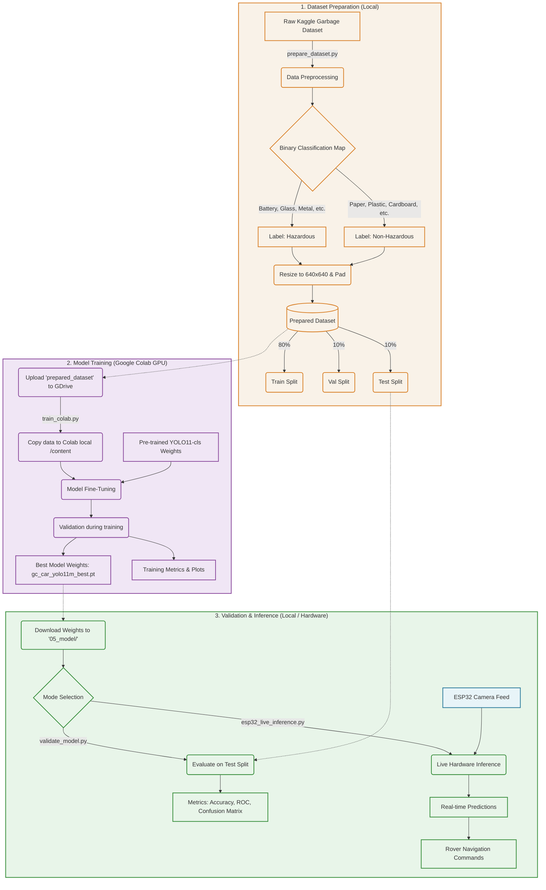

# Gesture Bot AI Workflow Flowchart

This flowchart visualizes the end-to-end process of preparing the dataset, training the model, and running inference for the Gesture Bot AI.

```mermaid
flowchart TD
    %% Define Styles
    classDef hardware fill:#e8f4f8,stroke:#2b7b9b,stroke-width:2px;
    classDef data fill:#f9f2e8,stroke:#d9822b,stroke-width:2px;
    classDef cloud fill:#f0e6f5,stroke:#8c4c9e,stroke-width:2px;
    classDef model fill:#e8f5e9,stroke:#388e3c,stroke-width:2px;

    %% 1. Dataset Preparation Phase
    subgraph DataPrep ["1. Dataset Preparation (Local)"]
        A[Raw Kaggle Garbage Dataset] -->|prepare_dataset.py| B(Data Preprocessing)
        B --> C{Binary Classification Map}
        C -->|Battery, Glass, Metal, etc.| D[Label: Hazardous]
        C -->|Paper, Plastic, Cardboard, etc.| E[Label: Non-Hazardous]
        D --> F(Resize to 640x640 & Pad)
        E --> F
        F --> G[(Prepared Dataset)]
        G -->|80%| H(Train Split)
        G -->|10%| I(Val Split)
        G -->|10%| J(Test Split)
    end
    class DataPrep,A,B,C,D,E,F,G,H,I,J data;

    %% 2. Training Phase
    subgraph Training ["2. Model Training (Google Colab GPU)"]
        K(Upload 'prepared_dataset' to GDrive)
        L[Pre-trained YOLO11-cls Weights]
        
        K -->|train_colab.py| M(Copy data to Colab local /content)
        M --> N(Model Fine-Tuning)
        L --> N
        N --> O(Validation during training)
        O --> P[Best Model Weights: gc_car_yolo11m_best.pt]
        O --> Q[Training Metrics & Plots]
    end
    class Training,K,L,M,N,O,P,Q cloud;

    %% 3. Validation & Inference Phase
    subgraph Inference ["3. Validation & Inference (Local / Hardware)"]
        R(Download Weights to '05_model/')
        S{Mode Selection}
        
        R --> S
        S -->|validate_model.py| T(Evaluate on Test Split)
        T --> U[Metrics: Accuracy, ROC, Confusion Matrix]
        
        S -->|esp32_live_inference.py| V(Live Hardware Inference)
        W[ESP32 Camera Feed] --> V
        V --> X[Real-time Predictions]
        X --> Y[Rover Navigation Commands]
    end
    class Inference,R,S,T,U,V,X,Y model;
    class W hardware;

    %% Connections between Subgraphs
    G -.-> K
    P -.-> R
    J -.-> T
```
